# Migration Plan: Gemini → Fully Self-Hosted Open Source

## Executive Summary

This document outlines the migration strategy from Google Gemini proprietary inference to a **100% self-hosted, open-source stack** deployable entirely on Coolify homelab infrastructure.

**Core Principles:**
- 🏠 **Full Self-Hosting** — No third-party cloud dependencies
- 🚫 **No Cloudflare** — Ideological preference for sovereignty
- 🌐 **Self-Hosted DNS** — Technitium DNS Server
- 📝 **Namecheap Registrar** — Domain registration only (no hosting)
- 🔒 **Maximum Data Sovereignty** — All inference runs on your hardware
- 💰 **Zero Recurring SaaS Costs** — Only electricity and hardware amortization

**What We're Eliminating:**
- ❌ Google Gemini API
- ❌ Google Cloud Run
- ❌ Cloudflare (DNS/CDN/Tunnel)
- ❌ Netlify / Vercel / Surge.sh
- ❌ OpenRouter / Together.ai / Groq
- ❌ Replicate / FAL.ai
- ❌ Any paid inference APIs

---

## Architecture Overview

### Current State (Proprietary Dependencies)


### Target State (100% Self-Hosted)


---

## Network Topology Map


---

## Phased Implementation Timeline


---

## Phase Details

### Phase 1: Infrastructure Foundation

**Duration: 5-7 days**

#### 1.1 Coolify Installation


**Coolify Benefits for Self-Hosting:**
- Git-based deployments (GitHub/GitLab/Gitea)
- Automatic SSL via Let's Encrypt
- Built-in Docker Compose support
- Environment variable management
- Resource monitoring
- No vendor lock-in

#### 1.2 Technitium DNS Server

```yaml
# coolify/stacks/technitium.yaml
services:
  technitium:
    image: technitium/dns-server:latest
    container_name: technitium-dns
    hostname: ns1
    ports:
      - "53:53/udp"
      - "53:53/tcp"
      - "5380:5380/tcp"   # Admin UI
      - "53443:53443/tcp" # DNS-over-HTTPS
    volumes:
      - technitium_config:/etc/dns/config
      - technitium_logs:/etc/dns/logs
    environment:
      - DNS_SERVER_DOMAIN=ns1.${DOMAIN}
      - DNS_SERVER_ADMIN_PASSWORD=${DNS_ADMIN_PASSWORD}
      - DNS_SERVER_PREFER_IPV6=false
      - DNS_SERVER_LOG_USING_LOCAL_TIME=true
    restart: unless-stopped
    networks:
      - dns_network

  ddclient:
    image: lscr.io/linuxserver/ddclient:latest
    container_name: ddclient
    volumes:
      - ./ddclient.conf:/config/ddclient.conf
    restart: unless-stopped
    networks:
      - dns_network

volumes:
  technitium_config:
  technitium_logs:

networks:
  dns_network:
    driver: bridge
```

**ddclient.conf for Dynamic IP:**
```conf
# /config/ddclient.conf
daemon=300
syslog=yes
pid=/var/run/ddclient/ddclient.pid
ssl=yes

# Update Technitium DNS via HTTP API
use=web, web=checkip.amazonaws.com
protocol=dyndns2
server=localhost:5380
login=admin
password='${DNS_ADMIN_PASSWORD}'
ns1.${DOMAIN}, ns2.${DOMAIN}, api.${DOMAIN}, app.${DOMAIN}
```

#### 1.3 Namecheap Configuration

| Record Type | Host | Value | Notes |
|-------------|------|-------|-------|
| **NS** | @ | ns1.yourdomain.com | Primary nameserver |
| **NS** | @ | ns2.yourdomain.com | Secondary (same IP OK) |
| **Glue A** | ns1 | YOUR_PUBLIC_IP | Set in Advanced DNS |
| **Glue A** | ns2 | YOUR_PUBLIC_IP | Set in Advanced DNS |

**In Technitium, create zones:**
- `yourdomain.com` (Primary Zone)
  - A record: `@` → Internal Caddy IP
  - A record: `api` → Internal Caddy IP
  - A record: `app` → Internal Caddy IP
  - A record: `*.` → Internal Caddy IP (wildcard)

#### 1.4 Caddy Reverse Proxy

```yaml
# coolify/stacks/caddy.yaml
services:
  caddy:
    image: caddy:2-alpine
    container_name: caddy-proxy
    ports:
      - "80:80"
      - "443:443"
      - "443:443/udp"  # HTTP/3
    volumes:
      - ./Caddyfile:/etc/caddy/Caddyfile:ro
      - caddy_data:/data
      - caddy_config:/config
    environment:
      - DOMAIN=${DOMAIN}
    restart: unless-stopped
    networks:
      - frontend
      - backend

volumes:
  caddy_data:
  caddy_config:

networks:
  frontend:
    external: true
  backend:
    external: true
```

**Caddyfile (Self-Hosted Frontend + API):**
```caddyfile
{
    email admin@{$DOMAIN}
    acme_ca https://acme-v02.api.letsencrypt.org/directory
}

# Main Application (React SPA)
app.{$DOMAIN} {
    root * /srv/app
    file_server
    try_files {path} /index.html

    encode gzip zstd

    header {
        X-Content-Type-Options nosniff
        X-Frame-Options DENY
        Referrer-Policy strict-origin-when-cross-origin
    }
}

# API Gateway
api.{$DOMAIN} {
    reverse_proxy hono-api:3001 {
        header_up Host {host}
        header_up X-Real-IP {remote_host}
    }

    header {
        Access-Control-Allow-Origin "https://app.{$DOMAIN}"
        Access-Control-Allow-Methods "GET, POST, PUT, DELETE, OPTIONS"
        Access-Control-Allow-Headers "Content-Type, Authorization"
    }
}

# ComfyUI (Protected)
comfyui.{$DOMAIN} {
    basicauth {
        admin $2a$14$Zkx3WDvK8Vs8Jkz... # bcrypt hash
    }
    reverse_proxy comfyui:8188
}

# SearxNG (Optional Public Access)
search.{$DOMAIN} {
    reverse_proxy searxng:8080
}

# Monitoring
status.{$DOMAIN} {
    reverse_proxy uptime-kuma:3001
}

# Coolify Dashboard (Protected)
coolify.{$DOMAIN} {
    reverse_proxy coolify:3000
}
```

---

### Phase 2: Support Services

**Duration: 3-4 days**


```yaml
# coolify/stacks/support-services.yaml
services:
  # ============================================
  # Caching Layer
  # ============================================
  valkey:
    image: valkey/valkey:7-alpine
    container_name: valkey-cache
    command: valkey-server --appendonly yes --maxmemory 2gb --maxmemory-policy allkeys-lru
    volumes:
      - valkey_data:/data
    restart: unless-stopped
    networks:
      - backend
    healthcheck:
      test: ["CMD", "valkey-cli", "ping"]
      interval: 10s
      timeout: 5s
      retries: 3

  # ============================================
  # Database
  # ============================================
  postgres:
    image: postgres:16-alpine
    container_name: postgres-db
    environment:
      - POSTGRES_USER=${PG_USER}
      - POSTGRES_PASSWORD=${PG_PASSWORD}
      - POSTGRES_DB=messynah
    volumes:
      - postgres_data:/var/lib/postgresql/data
      - ./init.sql:/docker-entrypoint-initdb.d/init.sql:ro
    restart: unless-stopped
    networks:
      - backend
    healthcheck:
      test: ["CMD-SHELL", "pg_isready -U ${PG_USER}"]
      interval: 10s
      timeout: 5s
      retries: 5

  # ============================================
  # Object Storage
  # ============================================
  minio:
    image: minio/minio:latest
    container_name: minio-storage
    command: server /data --console-address ":9001"
    environment:
      - MINIO_ROOT_USER=${MINIO_USER}
      - MINIO_ROOT_PASSWORD=${MINIO_PASSWORD}
    volumes:
      - minio_data:/data
    ports:
      - "9000:9000"
      - "9001:9001"
    restart: unless-stopped
    networks:
      - backend

  # ============================================
  # Search Engine
  # ============================================
  searxng:
    image: searxng/searxng:latest
    container_name: searxng
    volumes:
      - ./searxng/settings.yml:/etc/searxng/settings.yml:ro
      - ./searxng/limiter.toml:/etc/searxng/limiter.toml:ro
    environment:
      - SEARXNG_BASE_URL=https://search.${DOMAIN}
      - SEARXNG_SECRET=${SEARXNG_SECRET}
    restart: unless-stopped
    networks:
      - backend
    cap_drop:
      - ALL
    cap_add:
      - CHOWN
      - SETGID
      - SETUID

volumes:
  valkey_data:
  postgres_data:
  minio_data:

networks:
  backend:
    external: true
```

**SearxNG Settings (searxng/settings.yml):**
```yaml
use_default_settings: true

general:
  instance_name: "Self-Hosted Search"
  enable_metrics: false

search:
  safe_search: 0
  autocomplete: "google"
  default_lang: "en"
  formats:
    - html
    - json  # Required for API access

server:
  secret_key: "${SEARXNG_SECRET}"
  limiter: true
  image_proxy: true
  http_protocol_version: "1.1"

outgoing:
  request_timeout: 6.0
  max_request_timeout: 15.0

engines:
  - name: google
    engine: google
    shortcut: g
    disabled: false

  - name: duckduckgo
    engine: duckduckgo
    shortcut: ddg
    disabled: false

  - name: wikipedia
    engine: wikipedia
    shortcut: wp
    disabled: false

  - name: arxiv
    engine: arxiv
    shortcut: arx
    disabled: false
```

---

### Phase 3: LLM Inference

**Duration: 5-6 days**


```yaml
# coolify/stacks/llm-inference.yaml
services:
  # ============================================
  # Ollama - Local LLM Server
  # ============================================
  ollama:
    image: ollama/ollama:latest
    container_name: ollama
    volumes:
      - ollama_models:/root/.ollama
    environment:
      - OLLAMA_HOST=0.0.0.0
      - OLLAMA_ORIGINS=*
      - OLLAMA_NUM_PARALLEL=2
      - OLLAMA_MAX_LOADED_MODELS=2
    deploy:
      resources:
        reservations:
          devices:
            - driver: nvidia
              count: all
              capabilities: [gpu]
    restart: unless-stopped
    networks:
      - inference
    healthcheck:
      test: ["CMD", "curl", "-f", "http://localhost:11434/api/tags"]
      interval: 30s
      timeout: 10s
      retries: 3

  # ============================================
  # LiteLLM - OpenAI-Compatible Gateway
  # ============================================
  litellm:
    image: ghcr.io/berriai/litellm:main-latest
    container_name: litellm
    volumes:
      - ./litellm_config.yaml:/app/config.yaml:ro
    environment:
      - LITELLM_MASTER_KEY=${LITELLM_API_KEY}
      - LITELLM_LOG_LEVEL=INFO
    command: ["--config", "/app/config.yaml", "--port", "4000"]
    depends_on:
      ollama:
        condition: service_healthy
    restart: unless-stopped
    networks:
      - inference
      - backend

  # ============================================
  # Model Preloader (Init Container)
  # ============================================
  ollama-init:
    image: ollama/ollama:latest
    container_name: ollama-init
    depends_on:
      ollama:
        condition: service_healthy
    entrypoint: ["/bin/sh", "-c"]
    command:
      - |
        echo "Pulling models..."
        ollama pull llama3.3:70b-instruct-q4_K_M
        ollama pull qwen2.5:32b-instruct-q5_K_M
        ollama pull nomic-embed-text
        ollama pull llava:34b
        echo "All models ready!"
    environment:
      - OLLAMA_HOST=ollama:11434
    networks:
      - inference
    restart: "no"

volumes:
  ollama_models:

networks:
  inference:
    driver: bridge
  backend:
    external: true
```

**LiteLLM Configuration (100% Local):**
```yaml
# litellm_config.yaml
model_list:
  # Primary reasoning model
  - model_name: gpt-4
    litellm_params:
      model: ollama/llama3.3:70b-instruct-q4_K_M
      api_base: http://ollama:11434
    model_info:
      mode: chat
      max_tokens: 8192

  # Fast model for simple tasks
  - model_name: gpt-3.5-turbo
    litellm_params:
      model: ollama/qwen2.5:32b-instruct-q5_K_M
      api_base: http://ollama:11434
    model_info:
      mode: chat
      max_tokens: 32768

  # Embedding model
  - model_name: text-embedding-ada-002
    litellm_params:
      model: ollama/nomic-embed-text
      api_base: http://ollama:11434
    model_info:
      mode: embedding

  # Vision model
  - model_name: gpt-4-vision-preview
    litellm_params:
      model: ollama/llava:34b
      api_base: http://ollama:11434
    model_info:
      mode: chat

litellm_settings:
  drop_params: true
  set_verbose: false
  request_timeout: 600

router_settings:
  routing_strategy: "simple-shuffle"
  num_retries: 3
  timeout: 600
  retry_after: 5

  # Local-only fallback chain
  fallbacks:
    - gpt-4: [gpt-3.5-turbo]

general_settings:
  master_key: ${LITELLM_API_KEY}
```

---

### Phase 4: Image Generation

**Duration: 6-8 days**


```yaml
# coolify/stacks/image-generation.yaml
services:
  # ============================================
  # ComfyUI - Image Generation Backend
  # ============================================
  comfyui:
    image: ghcr.io/ai-dock/comfyui:pytorch-2.3.0-py3.11-cuda-12.1.0-runtime-22.04
    container_name: comfyui
    volumes:
      - comfyui_output:/workspace/ComfyUI/output
      - comfyui_input:/workspace/ComfyUI/input
      - comfyui_models:/workspace/ComfyUI/models
      - ./workflows:/workspace/ComfyUI/user/default/workflows:ro
    environment:
      - CLI_ARGS=--listen 0.0.0.0 --port 8188
    deploy:
      resources:
        reservations:
          devices:
            - driver: nvidia
              count: 1
              capabilities: [gpu]
    restart: unless-stopped
    networks:
      - inference
    healthcheck:
      test: ["CMD", "curl", "-f", "http://localhost:8188/system_stats"]
      interval: 30s
      timeout: 10s
      retries: 3

  # ============================================
  # Model Downloader (Init)
  # ============================================
  comfyui-models:
    image: alpine:latest
    container_name: comfyui-model-init
    volumes:
      - comfyui_models:/models
    entrypoint: ["/bin/sh", "-c"]
    command:
      - |
        apk add --no-cache wget aria2

        # FLUX.1-dev (requires HuggingFace login)
        echo "Download FLUX models manually or via HF CLI"

        # SDXL Base
        aria2c -x 16 -d /models/checkpoints \
          "https://huggingface.co/stabilityai/stable-diffusion-xl-base-1.0/resolve/main/sd_xl_base_1.0.safetensors"

        # SDXL Refiner
        aria2c -x 16 -d /models/checkpoints \
          "https://huggingface.co/stabilityai/stable-diffusion-xl-refiner-1.0/resolve/main/sd_xl_refiner_1.0.safetensors"

        # VAE
        aria2c -x 16 -d /models/vae \
          "https://huggingface.co/stabilityai/sdxl-vae/resolve/main/sdxl_vae.safetensors"

        echo "Base models downloaded!"
    restart: "no"

volumes:
  comfyui_output:
  comfyui_input:
  comfyui_models:

networks:
  inference:
    external: true
```

**ComfyUI API Integration Example:**
```typescript
// services/comfyui.ts
interface ComfyUIClient {
  queuePrompt(workflow: object): Promise<string>;
  getImage(filename: string): Promise<Buffer>;
  getStatus(promptId: string): Promise<PromptStatus>;
}

async function generateImage(prompt: string, style: string): Promise<string> {
  const workflow = loadWorkflow(style); // Load appropriate JSON workflow

  // Inject prompt into workflow
  workflow["6"]["inputs"]["text"] = prompt;

  // Queue the prompt
  const response = await fetch(`${COMFYUI_URL}/prompt`, {
    method: 'POST',
    headers: { 'Content-Type': 'application/json' },
    body: JSON.stringify({
      prompt: workflow,
      client_id: generateClientId()
    })
  });

  const { prompt_id } = await response.json();

  // Poll for completion
  while (true) {
    const status = await getStatus(prompt_id);
    if (status.completed) {
      const imageUrl = await saveToMinio(status.outputs[0]);
      return imageUrl;
    }
    await sleep(1000);
  }
}
```

---

### Phase 5: Video Generation

**Duration: 5-7 days**


```yaml
# coolify/stacks/video-generation.yaml
services:
  # ============================================
  # Mochi Video Generation
  # ============================================
  mochi:
    image: ghcr.io/genmoai/mochi:latest
    container_name: mochi-video
    volumes:
      - mochi_models:/models
      - mochi_output:/output
    environment:
      - MODEL_DIR=/models
      - OUTPUT_DIR=/output
    deploy:
      resources:
        reservations:
          devices:
            - driver: nvidia
              count: all
              capabilities: [gpu]
        limits:
          memory: 64G
    restart: unless-stopped
    networks:
      - inference
    command: ["python", "server.py", "--host", "0.0.0.0", "--port", "8000"]

  # ============================================
  # CogVideoX (Backup/Alternative)
  # ============================================
  cogvideox:
    image: ghcr.io/thudm/cogvideo:latest
    container_name: cogvideox
    volumes:
      - cogvideo_models:/models
      - cogvideo_output:/output
    environment:
      - CUDA_VISIBLE_DEVICES=0
    deploy:
      resources:
        reservations:
          devices:
            - driver: nvidia
              count: 1
              capabilities: [gpu]
    restart: unless-stopped
    networks:
      - inference
    profiles:
      - backup  # Only start manually

  # ============================================
  # Video Queue Worker
  # ============================================
  video-worker:
    build:
      context: ./video-worker
      dockerfile: Dockerfile
    container_name: video-worker
    environment:
      - REDIS_URL=redis://valkey:6379
      - MOCHI_URL=http://mochi:8000
      - COGVIDEO_URL=http://cogvideox:8000
      - MINIO_ENDPOINT=minio:9000
      - MINIO_ACCESS_KEY=${MINIO_USER}
      - MINIO_SECRET_KEY=${MINIO_PASSWORD}
    depends_on:
      - mochi
      - valkey
    restart: unless-stopped
    networks:
      - inference
      - backend

volumes:
  mochi_models:
  mochi_output:
  cogvideo_models:
  cogvideo_output:

networks:
  inference:
    external: true
  backend:
    external: true
```

---

### Phase 6: API Development

**Duration: 7-9 days**


**API Structure:**
```
api/
├── src/
│   ├── index.ts              # Hono app entry
│   ├── middleware/
│   │   ├── auth.ts           # API key validation
│   │   ├── cors.ts           # CORS configuration
│   │   ├── rateLimit.ts      # Rate limiting
│   │   └── logging.ts        # Request logging
│   ├── routes/
│   │   ├── v1/
│   │   │   ├── research.ts   # Research endpoints
│   │   │   ├── images.ts     # Image endpoints
│   │   │   ├── videos.ts     # Video endpoints
│   │   │   └── health.ts     # Health checks
│   │   └── index.ts
│   ├── services/
│   │   ├── llm.ts            # LiteLLM client
│   │   ├── search.ts         # SearxNG client
│   │   ├── comfyui.ts        # ComfyUI client
│   │   ├── video.ts          # Video queue
│   │   └── storage.ts        # MinIO client
│   ├── utils/
│   │   ├── prompts.ts        # System prompts
│   │   └── validation.ts     # Zod schemas
│   └── types/
│       └── index.ts
├── Dockerfile
├── package.json
└── tsconfig.json
```

---

### Phase 7: Frontend Deployment

**Duration: 3-4 days**


**Frontend Dockerfile:**
```dockerfile
# Dockerfile.frontend
FROM node:20-alpine AS builder
WORKDIR /app
COPY package*.json ./
RUN npm ci
COPY . .
RUN npm run build

FROM caddy:2-alpine
COPY --from=builder /app/dist /srv
COPY Caddyfile.frontend /etc/caddy/Caddyfile
EXPOSE 80
```

**Frontend Caddyfile:**
```caddyfile
# Caddyfile.frontend
:80 {
    root * /srv
    file_server
    try_files {path} /index.html

    encode gzip zstd

    header {
        Cache-Control "public, max-age=31536000, immutable"
        X-Content-Type-Options nosniff
    }

    @static {
        path *.js *.css *.png *.jpg *.svg *.woff2
    }
    header @static Cache-Control "public, max-age=31536000, immutable"
}
```

---

### Phase 8: Monitoring & Hardening

**Duration: 5-7 days**


```yaml
# coolify/stacks/monitoring.yaml
services:
  # ============================================
  # Uptime Monitoring
  # ============================================
  uptime-kuma:
    image: louislam/uptime-kuma:latest
    container_name: uptime-kuma
    volumes:
      - uptime_data:/app/data
    restart: unless-stopped
    networks:
      - monitoring

  # ============================================
  # Metrics
  # ============================================
  prometheus:
    image: prom/prometheus:latest
    container_name: prometheus
    volumes:
      - ./prometheus.yml:/etc/prometheus/prometheus.yml:ro
      - prometheus_data:/prometheus
    command:
      - '--config.file=/etc/prometheus/prometheus.yml'
      - '--storage.tsdb.path=/prometheus'
      - '--storage.tsdb.retention.time=30d'
    restart: unless-stopped
    networks:
      - monitoring
      - backend

  grafana:
    image: grafana/grafana:latest
    container_name: grafana
    environment:
      - GF_SECURITY_ADMIN_PASSWORD=${GRAFANA_PASSWORD}
      - GF_USERS_ALLOW_SIGN_UP=false
    volumes:
      - grafana_data:/var/lib/grafana
      - ./grafana/provisioning:/etc/grafana/provisioning:ro
    restart: unless-stopped
    networks:
      - monitoring

  # ============================================
  # Logs
  # ============================================
  loki:
    image: grafana/loki:latest
    container_name: loki
    volumes:
      - loki_data:/loki
    restart: unless-stopped
    networks:
      - monitoring

  # ============================================
  # Notifications (Self-Hosted)
  # ============================================
  ntfy:
    image: binwiederhier/ntfy:latest
    container_name: ntfy
    command:
      - serve
      - --cache-file=/var/lib/ntfy/cache.db
      - --base-url=https://ntfy.${DOMAIN}
    volumes:
      - ntfy_data:/var/lib/ntfy
    restart: unless-stopped
    networks:
      - monitoring

volumes:
  uptime_data:
  prometheus_data:
  grafana_data:
  loki_data:
  ntfy_data:

networks:
  monitoring:
    driver: bridge
  backend:
    external: true
```

---

## Complete Stack Overview


---

## Hardware Requirements


---

## Cost Analysis (100% Self-Hosted)

| Component | Cloud (Google + Gemini) | Self-Hosted | Savings |
|-----------|------------------------|-------------|---------|
| **LLM API Calls** | $50-500/mo | $0 | 100% |
| **Image Generation** | $20-200/mo | $0 | 100% |
| **Video Generation** | $50-1000/mo | $0 | 100% |
| **Cloud Hosting** | $50-200/mo | $0 | 100% |
| **CDN/Edge** | $20-100/mo | $0 | 100% |
| **DNS** | $5-20/mo | $0 | 100% |
| **Electricity** | N/A | $40-80/mo | - |
| **Internet (Business)** | N/A | $50-100/mo | - |
| **Hardware (5yr amort.)** | N/A | $80-200/mo | - |
| **TOTAL** | **$195-2020/mo** | **$170-380/mo** | **~70-85%** |

**Break-even Analysis:**
- Initial hardware investment: $3,000 - $15,000
- Monthly operational cost: $170 - $380
- Break-even vs cloud: 3-12 months (depending on usage)

---

## Security Hardening Checklist

```mermaid
flowchart TB
    subgraph "Network Security"
        N1[✓ Firewall Rules]
        N2[✓ VLAN Segmentation]
        N3[✓ No Exposed Ports]
        N4[✓ TLS Everywhere]
    end

    subgraph "Application Security"
        A1[✓ API Authentication]
        A2[✓ Rate Limiting]
        A3[✓ Input Validation]
        A4[✓ CORS Restrictions]
    end

    subgraph "Infrastructure Security"
        I1[✓ SSH Key Only]
        I2[✓ Fail2ban]
        I3[✓ Automatic Updates]
        I4[✓ Container Isolation]
    end

    subgraph "Data Security"
        D1[✓ Encrypted Storage]
        D2[✓ Backup Strategy]
        D3[✓ Secret Management]
        D4[✓ No External Telemetry]
    end
```



---

## Rollback Strategy


---

## Success Criteria

| Metric | Target | Measurement Method |
|--------|--------|-------------------|
| **Zero Cloud Dependencies** | 100% | Architecture audit |
| **API Response Time (P95)** | <3s text, <45s image | Prometheus |
| **System Uptime** | >99% | Uptime Kuma |
| **Image Quality** | ≥90% of Gemini | Human A/B testing |
| **Video Generation** | 5s @ 720p | Functional test |
| **Cost Reduction** | >70% | Monthly tracking |
| **Data Sovereignty** | 100% local | Network audit |

---

## Appendix: Environment Variables

```bash
# .env.example

# Domain
DOMAIN=yourdomain.com

# DNS
DNS_ADMIN_PASSWORD=your-secure-password

# Database
PG_USER=messynah
PG_PASSWORD=your-secure-password

# Object Storage
MINIO_USER=minio-admin
MINIO_PASSWORD=your-secure-password

# API Authentication
LITELLM_API_KEY=sk-your-litellm-key
API_SECRET_KEY=your-api-secret

# Search
SEARXNG_SECRET=your-searxng-secret

# Monitoring
GRAFANA_PASSWORD=your-grafana-password

# No external API keys needed!
# Everything runs locally.
```

---

*Document Version: 2.0*
*Last Updated: December 2024*
*Architecture: 100% Self-Hosted via Coolify*
